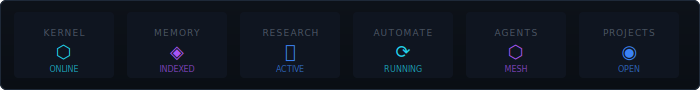
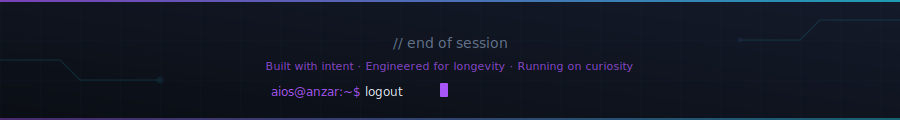

<div align="center">



</div>

<div align="center">

[](https://github.com/Anzar0904)

</div>

<br/>

---

<!-- // 01_BOOT_SEQUENCE -->
## ⚡ Boot Sequence

<div align="center">



</div>


<!-- // 02_ABOUT_ME -->
## 👤 About

```
aios@anzar:~$ whoami

  operator     Anzar Akhtar
  handle       @Anzar0904
  role         AI/ML Engineering Student

  focus        Building AIOS
               Personal AI Operating System

  interests    AI Systems · Multi-Agent AI
               Full-Stack Development · Automation

  currently    AIOS · CampusConnect

  status       ● online — shipping consistently

aios@anzar:~$ █
```


<!-- // 03_MISSION -->
## 🎯 Mission

```python
class Mission:
    WHY_AIOS = """
    I'm exploring how AI systems can be built as modular operating
    systems rather than single-purpose tools — with a kernel, a
    memory engine, an agent runtime, and an automation layer,
    built from first principles in Python.
    """

    THESIS = "AI-native software benefits from AI-native architecture."

    VISION = """
    A personal AI OS that persists context across sessions,
    coordinates multi-agent workflows, and improves through use —
    built incrementally, one working layer at a time.
    """
```


<!-- // 04_AI_DASHBOARD -->
## 🧠 AI Dashboard

<div align="center">



</div>


<!-- // 05_FEATURED_PROJECTS -->
## 🚀 Featured Projects

<table width="100%" cellpadding="0" cellspacing="0">
<tr>

<td width="50%" valign="top">

### 🧠 AIOS — Artificial Intelligence OS

| Field | Value |
|---|---|
| **Status** | 🟢 Active Development |
| **Layers** | Core → Integration → Skill → Interface |

**What it is:** A personal AI Operating System built from scratch. Not a wrapper around a model — a full kernel, memory engine, agent runtime, and automation pipeline engineered in Python with a strict 4-layer, unidirectional architecture.

**Tech stack:**


**Roadmap:**
- ✅ Architecture audit, kernel, memory engine, and provider layer shipped
- 🔄 Agent runtime and multi-agent task routing
- ⏳ Full autonomous orchestration and task completion

</td>

<td width="50%" valign="top">

### 🎓 CampusConnect

| Field | Value |
|---|---|
| **Status** | 🔵 Production Ready |
| **Stack** | Next.js 14 · Supabase · TypeScript |

**What it is:** Full-stack social platform for IILM University — posts, DMs, clubs, marketplace, study rooms, coding arena, dating feature, and admin portal. Glassmorphism design system. Security-hardened with RLS policies, PKCE auth, and CSP headers.

**Tech stack:**


**Roadmap:**
- ✅ Core social features shipped
- ✅ Security hardening complete
- 🔄 AI-powered features (AIOS integration)
- ⏳ Full university rollout

</td>

</tr>
<tr>

<td width="100%" colspan="2" valign="top">

### ⚙️ Automation Lab

| Field | Value |
|---|---|
| **Status** | 🟢 Active Development |
| **Engine** | n8n · Python · OpenRouter |

**What it is:** AI workflow automation platform built with Python, n8n, and LLM APIs. The operational testbed for AIOS's automation layer.

**Tech stack:**


**Roadmap:**
- ✅ Omni-channel lead gen workflow
- ✅ Multi-LLM routing via OpenRouter
- 🔄 AIOS kernel integration
- ⏳ Self-healing workflow error recovery

</td>

</tr>
</table>


<!-- // 05B_RESEARCH -->
## 🔬 Research & Experiments

**Class-Imbalance-Aware Multi-Region Glioma Segmentation** — Attention U-Net with Focal Tversky Loss, trained on BraTS 2024. IEEE conference paper formatted and submitted.
`PyTorch` `NumPy` `Kaggle`


<!-- // 06_TECH_STACK -->
## 🛠️ Tech Stack

### Languages


### AI


### Frontend


### Backend


### Cloud & Database


### Developer Tools


<!-- // 07_GITHUB_DASHBOARD -->
## 📊 GitHub Dashboard

<div align="center">

<table width="100%" cellpadding="8" cellspacing="0">
<tr>
<td align="center" width="50%">

[](https://github.com/Anzar0904)

</td>
<td align="center" width="50%">

[](https://github.com/Anzar0904)

</td>
</tr>
<tr>
<td align="center" width="50%">

[](https://github.com/Anzar0904)

</td>
<td align="center" width="50%">

[](https://github.com/Anzar0904)

</td>
</tr>
</table>

</div>

### Activity Graph

[](https://github.com/Anzar0904)

### Contribution Snake

<div align="center">


> *Snake animation refreshes daily via GitHub Actions. If the image is missing, the `snake.yml` workflow has not yet run — trigger it manually from the Actions tab.*

</div>

### Recent Activity

<!--START_SECTION:activity-->
1. 🎉 Merged PR [#3](https://github.com/Anzar0904/demo/pull/3) in [Anzar0904/demo](https://github.com/Anzar0904/demo)
<!--END_SECTION:activity-->

### Metrics

<div align="center">



> *Metrics image refreshes daily via GitHub Actions.*

</div>


<!-- // 08_CURRENTLY_BUILDING -->
## 🧭 Currently Building

| Module | Status |
|---|---|
| 🧠 AIOS | Active development |
| ⚙️ Agent Runtime | Building |
| 🗄️ Memory Engine | In progress |
| 🤖 Provider Layer | Active |
| 🎓 CampusConnect | Active development |


<!-- // 09_ROADMAP -->
## 🗺️ Roadmap

<table width="100%" cellpadding="8" cellspacing="0">
<thead>
<tr>
<th align="left" width="33%">✅ Now</th>
<th align="left" width="33%">⏳ Next</th>
<th align="left" width="33%">🔭 Future</th>
</tr>
</thead>
<tbody>
<tr>
<td valign="top">

- Agent runtime
- Multi-agent task routing
- Context window management
- CampusConnect AI integration
- Automation Lab pipeline expansion

</td>
<td valign="top">

- Full autonomous agent orchestration
- Agent-to-agent communication protocol
- Self-healing workflow recovery
- AIOS CLI (v1)
- CampusConnect production deployment
- Glioma segmentation paper submission

</td>
<td valign="top">

- AIOS v1.0 — public release
- Multi-modal memory (text + vision)
- Personal knowledge graph
- Real-time collaboration layer
- AIOS SDK for third-party integration
- Portfolio site powered by AIOS

</td>
</tr>
</tbody>
</table>


<!-- // 10_DEVELOPER_PHILOSOPHY -->
## 💭 Developer Philosophy

<!--START_SECTION:quote-->
> "Four layers. One direction. No exceptions."
<!--END_SECTION:quote-->

```python
class AIOSDeveloperPhilosophy:
    """
    Engineering principles that keep a solo-built AI OS
    maintainable as it grows.
    """

    LAW_1_ARCHITECTURE  = "Four layers: Core → Integration → Skill → Interface. Never skip, never invert."
    LAW_2_DIRECTION     = "Dependencies flow downward only. The kernel knows nothing about agents."
    LAW_3_BUGS          = "A confirmed bug is a gift. An assumed fix is a liability."
    LAW_4_COMPLEXITY    = "Complexity that cannot be explained cannot be maintained."
    LAW_5_INTERFACE     = "The interface is a promise. The implementation is the proof."

    def ship(self, feature: str, tests: bool, docs: bool) -> str:
        assert tests, "No tests — no merge."
        assert docs, "No docs — no merge."
        return f"✅ {feature} shipped."
```


<!-- // 11_LEARNING_JOURNEY -->
## 📅 Learning Journey

- **2021** — Started programming: Python fundamentals, first scripts and automations
- **2022** — Web development foundations: HTML, CSS, JavaScript; first full-stack project
- **2023** — IILM University, Computer Science: React & Next.js, Supabase & PostgreSQL; CampusConnect conceived
- **2024** — AI/ML deep dive: PyTorch, Attention U-Net; glioma segmentation research (BraTS 2024), IEEE paper authored; AIOS conceptualized
- **2025 – Present** — Building AIOS: four-layer architecture, memory engine, agent runtime in progress; CampusConnect launched at IILM; Automation Lab operational


<!-- // 12_ACHIEVEMENTS -->
## 🏆 Achievements

<div align="center">

| Achievement | Detail |
|---|---|
| 🧠 **AIOS** | Personal AI Operating System — kernel, memory engine, and agent runtime built from first principles in Python |
| 🔬 **ML Research** | Attention U-Net + Focal Tversky Loss on BraTS 2024 · IEEE paper authored |
| 🎓 **CampusConnect** | Full-stack university social platform · RLS + PKCE security hardened |
| ⚙️ **Automation Lab** | AI workflow automation platform built with Python, n8n, and LLM APIs |

</div>


<!-- // 13_OPEN_SOURCE -->
## 🌐 Open Source

<div align="center">


</div>

AIOS is being developed openly, with architecture decisions and engineering principles documented throughout the repository. It's an ongoing attempt to work through the challenges of building a personal AI system as a solo developer, in the open.

**Contributing philosophy:** issues and PRs are welcome on CampusConnect and Automation Lab. AIOS core follows a strict review process (architecture changes require a design doc) — not gatekeeping, just protecting the four-layer invariant that AIOS is built on.


<!-- // 13B_OPPORTUNITIES -->
## 🤝 Opportunities

Currently interested in:
- AI engineering internships
- Open source collaboration
- AI systems engineering
- Building ambitious software


<!-- // 14_CONNECT -->
## 📡 Connect

<div align="center">

[](https://github.com/Anzar0904)
[](https://linkedin.com/in/anzar-khan-0904)
[](mailto:anzar0904@gmail.com)

</div>

```
aios@anzar:~$ ping anzar

  CONNECT  → github.com/Anzar0904
  NETWORK  → open to collaboration · research · AI systems
  LATENCY  → responses within 24h
  PROTOCOL → issues · PRs · DMs all accepted

aios@anzar:~$ █
```


<!-- // 15_FOOTER -->

<div align="center">



<br/>

<sub>

Built with intent · Engineered for longevity · Running on curiosity

</sub>

</div>
