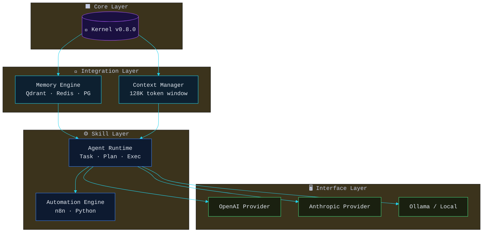
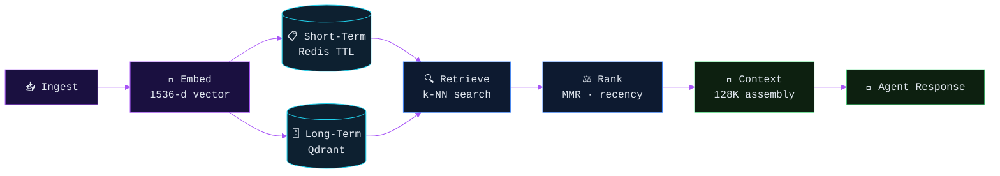
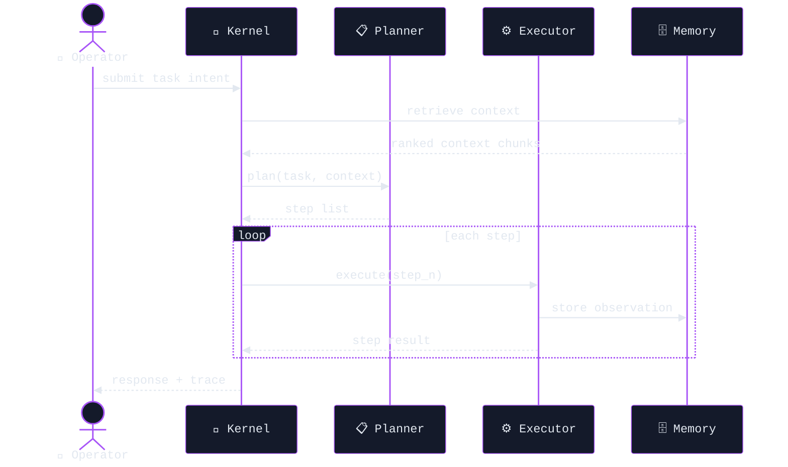
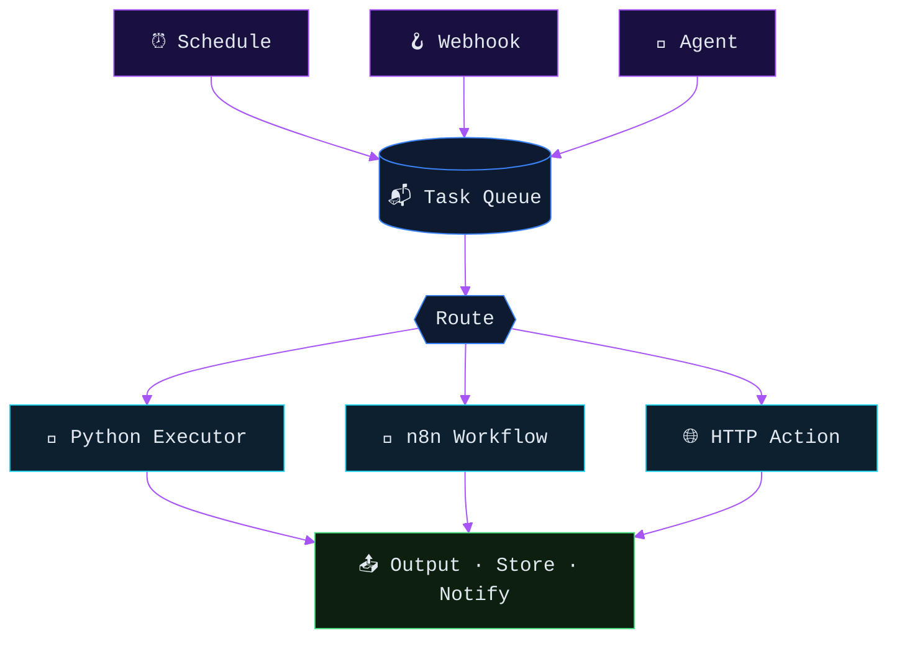
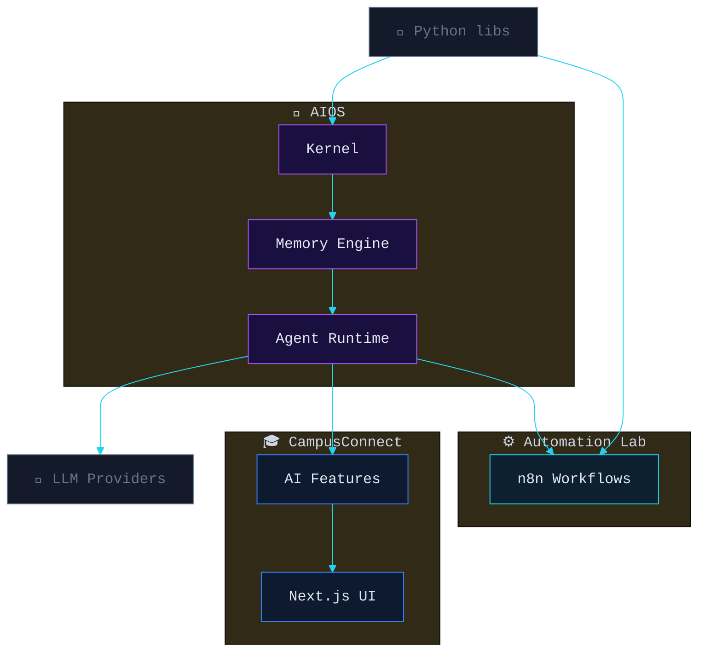
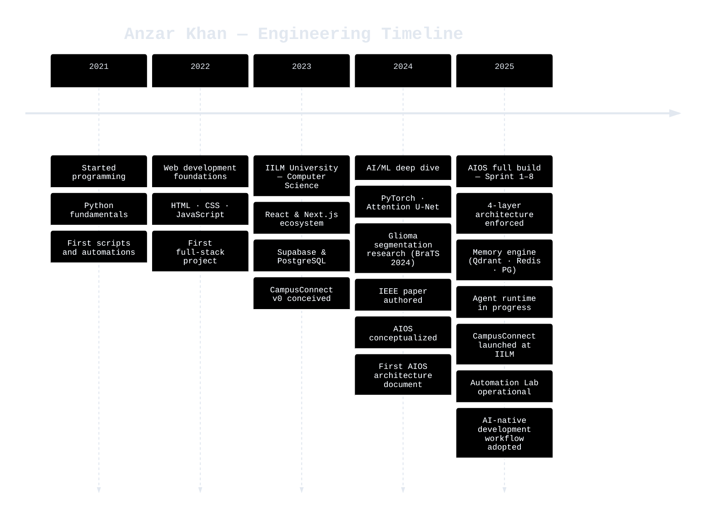

<div align="center">


</div>

<div align="center">

[](https://git.io/typing-svg)

</div>

<br/>

---

<!-- // 01_BOOT_SEQUENCE -->
## ⚡ Boot Sequence

<div align="center">


</div>


<!-- // 02_ABOUT_ME -->
## 👤 About

```
aios@anzar:~$ whoami

  operator     Anzar Khan
  handle       Anzar0904
  role         AI Engineer · System Architect · Solo Developer
  location     Gurugram, India · IILM University
  focus        Building AIOS — a Personal AI Operating System from first principles
  current      Sprint 8 · Agent Runtime · Engineering Bible (123 services documented)
  research     ML · Deep Learning · Glioma Brain Tumor Segmentation · Attention U-Net
  philosophy   "Four layers. One direction. No exceptions."
  status       ● online — shipping daily

aios@anzar:~$ █
```


<!-- // 03_MISSION -->
## 🎯 Mission

```python
class Mission:
    WHY_AIOS = """
    Most people use AI tools. I'm building the operating system that runs them.

    AIOS is not a product. It is a personal infrastructure project —
    a kernel, a memory engine, an agent runtime, and an automation layer
    built from first principles in Python. Every design decision is documented.
    Every sprint is tracked. Every law is enforced.
    """

    THESIS = "AI-native software demands AI-native architecture."

    VISION = """
    A fully autonomous personal AI OS that persists context across sessions,
    orchestrates multi-agent workflows, and learns from every interaction —
    the foundation for every project I will build for the next decade.
    """
```


<!-- // 04_AI_DASHBOARD -->
## 🧠 AI Dashboard

<div align="center">


</div>

> **Note:** Dashboard reflects illustrative system state based on current sprint. All modules exist — status shows development phase, not deployment health.


<!-- // 05_FEATURED_PROJECTS -->
## 🚀 Featured Projects

<table width="100%" cellpadding="0" cellspacing="0">
<tr>

<td width="50%" valign="top">

### 🧠 AIOS — Artificial Intelligence OS

| Field | Value |
|---|---|
| **Status** | 🟡 Building — Sprint 8 |
| **Progress** | ████████░░ 80% |
| **Layer** | Core → Integration → Skill → Interface |

**What it is:** A personal AI Operating System built from scratch. Not a wrapper around a model — a full kernel, memory engine, agent runtime, and automation pipeline engineered in Python with a strict 4-layer unidirectional architecture.

**Tech stack:**


**Roadmap:**
- ✅ S0: Architecture audit · 14 bugs confirmed · fixed
- ✅ S1–S7: Kernel · Memory · Context · Provider layer
- 🔄 S8: Agent Runtime · Engineering Bible
- ⏳ S9: Full agent orchestration
- ⏳ S10: Autonomous task completion

</td>

<td width="50%" valign="top">

### 🎓 CampusConnect (IILM Connect)

| Field | Value |
|---|---|
| **Status** | 🟢 Live — Active development |
| **Progress** | ███████░░░ 70% |
| **Stack** | Next.js 14 · Supabase · TypeScript |

**What it is:** Full-stack social platform for IILM University — posts, DMs, clubs, marketplace, study rooms, coding arena, dating feature, and admin portal. Glassmorphism design system. Security-hardened with RLS policies, PKCE auth, and CSP headers.

**Tech stack:**


**Roadmap:**
- ✅ Core social features shipped
- ✅ Security hardening complete
- ✅ Schema restoration after DB incident
- 🔄 AI-powered features (AIOS integration)
- ⏳ Production deployment
- ⏳ Full university rollout

</td>

</tr>
<tr>

<td width="50%" valign="top">

### ⚙️ Automation Lab

| Field | Value |
|---|---|
| **Status** | 🟢 Operational — Expanding |
| **Progress** | ██████░░░░ 60% |
| **Engine** | n8n · Python · OpenRouter |

**What it is:** Multi-service automation system covering AI lead generation and outreach, integrating Apollo.io, Crunchbase, Clearbit, Hunter.io, and OpenRouter through n8n workflow JSON pipelines. The operational testbed for AIOS's automation layer.

**Tech stack:**


**Roadmap:**
- ✅ Omni-channel lead gen workflow
- ✅ Multi-LLM routing via OpenRouter
- 🔄 AIOS kernel integration
- ⏳ Self-healing workflow error recovery
- ⏳ Full audit trail + metrics dashboard

</td>

<td width="50%" valign="top">

### 🔬 Research Projects

| Field | Value |
|---|---|
| **Status** | 🟡 Academic · Ongoing |
| **Progress** | ████░░░░░░ 40% |
| **Domain** | Medical AI · Computer Vision |

**What it is:** Academic ML/deep learning research at IILM University. Current flagship: *Class-Imbalance-Aware Multi-Region Glioma Segmentation* using Attention U-Net with Focal Tversky Loss, trained on BraTS 2024 dataset. IEEE conference paper formatted and submitted.

**Tech stack:**


**Roadmap:**
- ✅ Attention U-Net architecture implemented
- ✅ Focal Tversky Loss tuned for class imbalance
- ✅ IEEE paper formatted
- 🔄 BraTS 2024 full training run
- ⏳ Ablation studies
- ⏳ Conference submission

</td>

</tr>
</table>


<!-- // 06_TECH_STACK -->
## 🛠️ Tech Stack

### Languages


### Frontend


### Backend


### AI / ML


### LLMs & AI Providers


### Databases & Storage


### Cloud & Infrastructure


### Automation


### Developer Tools


### DevOps


### Operating Systems


<!-- // 07_GITHUB_DASHBOARD -->
## 📊 GitHub Dashboard

<div align="center">

<table width="100%" cellpadding="8" cellspacing="0">
<tr>
<td align="center" width="50%">

[](https://github.com/Anzar0904)

</td>
<td align="center" width="50%">

[](https://github.com/Anzar0904)

</td>
</tr>
<tr>
<td align="center" width="50%">

[](https://github.com/Anzar0904)

</td>
<td align="center" width="50%">

[](https://github.com/Anzar0904)

</td>
</tr>
</table>

</div>

### Activity Graph

[](https://github.com/Anzar0904)

### Contribution Snake

<div align="center">


> *Snake animation refreshes daily via GitHub Actions. If the image is missing, the `snake.yml` workflow has not yet run — trigger it manually from the Actions tab.*

</div>

### Recent Activity

<!--START_SECTION:activity-->
> *Recent GitHub activity loads here automatically. The `recent-activity.yml` workflow populates this section daily.*
<!--END_SECTION:activity-->

### Metrics

<div align="center">


> *Metrics image refreshes daily via GitHub Actions.*

</div>

### Visitor Counter

<div align="center">


</div>


<!-- // 08_ARCHITECTURE -->
## 🏗️ Architecture

### AIOS System Architecture



### Memory Flow



### Agent Communication



### Automation Engine



### Project Ecosystem




<!-- // 09_ROADMAP -->
## 🗺️ Roadmap

<table width="100%" cellpadding="8" cellspacing="0">
<thead>
<tr>
<th align="left" width="33%">✅ Current (Sprint 8)</th>
<th align="left" width="33%">⏳ Upcoming (S9–S10)</th>
<th align="left" width="33%">🔭 Future (2025–2026)</th>
</tr>
</thead>
<tbody>
<tr>
<td valign="top">

- Agent Runtime implementation
- Engineering Bible: 123 services fully documented
- Multi-agent task routing
- Context window management (128K)
- CampusConnect AI feature integration
- Automation Lab n8n pipeline expansion

</td>
<td valign="top">

- Full autonomous agent orchestration
- Agent-to-agent communication protocol
- Self-healing workflow error recovery
- AIOS CLI interface (v1)
- CampusConnect production deployment
- Glioma segmentation paper submission

</td>
<td valign="top">

- AIOS v1.0 — public release
- Multi-modal memory (text + vision)
- Personal knowledge graph
- Real-time collaboration layer
- AIOS SDK for third-party integration
- Portfolio site powered by AIOS

</td>
</tr>
</tbody>
</table>


<!-- // 10_DEVELOPER_PHILOSOPHY -->
## 💭 Developer Philosophy

<!--START_SECTION:quote-->
> "Four layers. One direction. No exceptions." — AIOS Engineering Constitution §1
<!--END_SECTION:quote-->

```python
class AIOSDeveloperPhilosophy:
    """
    The engineering values that govern every line of code
    written for AIOS and every project in the ecosystem.
    Derived from the AIOS Engineering Constitution.
    """

    # Core identity
    operator: str = "Anzar Khan"
    mission: str = "Build an AI OS from first principles"
    approach: str = "Solo developer · AI-assisted · Sprint-gated"

    # Architectural laws (condensed from the Engineering Constitution)
    LAW_1_ARCHITECTURE  = "Four layers: Core → Integration → Skill → Interface. Never skip, never invert."
    LAW_2_DIRECTION     = "Dependencies flow downward only. The kernel knows nothing about agents."
    LAW_3_OPERATOR      = "Build for the operator running this at 3 AM, not the demo audience."
    LAW_4_SESSIONS      = "Every AI coding session opens with a handoff document. Every session closes with one."
    LAW_5_BUGS          = "A confirmed bug is a gift. An assumed fix is a liability."
    LAW_6_SCOPE         = "Feature requests entering a sprint must leave as shipped code or documented deferrals."
    LAW_7_COMPLEXITY    = "Complexity that cannot be explained cannot be maintained."
    LAW_8_DOCS          = "The spec and the code must agree. When they diverge, fix both."
    LAW_9_FUTURE_SELF   = "Documentation is the operating manual for your future self."
    LAW_10_DISCIPLINE   = "AI-assisted development demands more discipline, not less."
    LAW_11_INTERFACE    = "The interface is a promise. The implementation is the proof."
    LAW_12_SCALE        = "A system that scales gracefully was designed that way from day one."

    def __repr__(self) -> str:
        return f"<DeveloperPhilosophy: {self.mission}>"

    def ship(self, feature: str, tests: bool, docs: bool) -> str:
        assert tests, "No tests — no merge."
        assert docs, "No docs — no merge."
        return f"✅ {feature} shipped to Sprint log."
```


<!-- // 11_LEARNING_JOURNEY -->
## 📅 Learning Journey




<!-- // 12_ACHIEVEMENTS -->
## 🏆 Achievements

<div align="center">

| Achievement | Detail |
|---|---|
| 🧠 **AIOS Sprint 8** | 123 services · 4-layer architecture · Engineering Bible authored |
| 📚 **Engineering Constitution** | 12 named engineering laws · AI coding session protocol established |
| 🔬 **ML Research** | Attention U-Net + Focal Tversky Loss · BraTS 2024 · IEEE paper |
| 🎓 **CampusConnect** | Full-stack university social platform · RLS + PKCE security hardened |
| ⚙️ **Automation Lab** | Omni-channel AI lead gen · Apollo · Crunchbase · OpenRouter integrated |
| 🛡️ **Security** | Credential exposure remediation · CSP headers · Schema restoration post-incident |
| 🤖 **AI Coding Pioneer** | Claude · Gemini · Cursor · Windsurf as first-class dev contributors |

</div>


<!-- // 13_OPEN_SOURCE -->
## 🌐 Open Source

<div align="center">


</div>

AIOS is built in the open. Architecture decisions, sprint logs, and engineering laws are all documented in the repository. The goal is to demonstrate that serious AI systems engineering is achievable as a solo developer with discipline and the right tools.

**Contributing philosophy:** issues and PRs are welcome on CampusConnect and Automation Lab. AIOS core follows a strict review process (architecture changes require a design doc) — not gatekeeping, just protecting a four-layer invariant that took eight sprints to build.

<div align="center">


</div>


<!-- // 14_CONNECT -->
## 📡 Connect

<div align="center">

[](https://github.com/Anzar0904)
[](https://linkedin.com/in/anzar-khan-0904)
[](mailto:anzar0904@gmail.com)

</div>

```
aios@anzar:~$ ping anzar

  CONNECT  → github.com/Anzar0904
  NETWORK  → open to collaboration · research · AI systems
  LATENCY  → responses within 24h
  PROTOCOL → issues · PRs · DMs all accepted

aios@anzar:~$ █
```


<!-- // 15_FOOTER -->
## 

<div align="center">


<br/>

<sub>

`README.md` is the single source of truth · `docs/DESIGN.md` is the governing specification · Bot commits use prefix `chore(bot):` · Human commits are everything else

Built with intent · Engineered for longevity · Running on curiosity

</sub>

</div>
